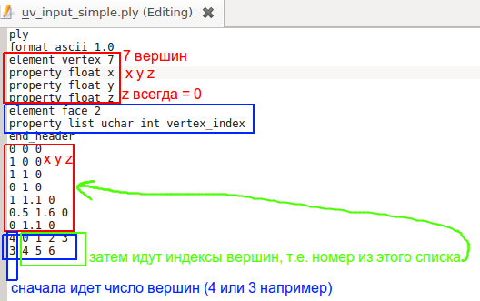

# Тестовое задание

1) Закодить примитивный запаковщик который принимает на вход один из приложенных трех ply-файлов
2) В каждом ply файле есть набор чартов-полигонов (т.е. кусочков геометрии лежащих на плоскости), они уже образуют
   корректный атлас, но это просто пример хорошего результата
3) Предполагается что программа игнорирует глобальные координаты этих чартов и учитывает лишь форму каждого из них (т.е.
   можно считать что каждый полигон при считывании смещается своим центроидом в начало отсчета системы координат), иначе
   говоря - не предполагается использовать как подсказку взаимное расположение чартов во входном файле (т.к. оно "как
   есть" является уже хорошим ответом)
4) На выход надо сгенерировать такой же файл, но чарты расположены так чтобы:
    - никакие два чарта не пересекались (но могут касаться друг друга)
    - квадратный bounding box описанный вокруг всех чартов был как можно меньшей площади (нормально что во входных
      примерах он будет еще меньше - там использовался достаточно сложный алгоритм)
5) Посчитать размер полученного описанного bounding box и сравнить его с bounding box входного ply-файла
6) Отправить мне получившиеся ply-файлы с результатами + размеры получившихся bounding box + получившийся код
7) В решении ожидается достаточным грубая работа с каждым чартом - например заменив каждый из них на прямоугольный
   bounding box
8) Каждый чарт можно поворачивать на 90 градусов, но это не требуется реализовывать
9) Кроме решения нужно так же подумать (и/или найти в исходниках xatlas/thekla_atlas и понять в общих чертах) - как
   работать с чартами более аккуратно, учитывая их контуры (а не просто заменяя их на bounding box-ы)
10) Если что - отвечу на любые вопросы
11) Посмотреть на эти ply файлы можно в meshlab (правда она показывает чарты тривиальной триангуляцией - поэтому немного
    лажает с невыпуклыми фигурами)

Пояснение по поводу использованного формата ply файлов (наример тут 7 вершин, и два полигона - один из четырех вершин,
друго из трех вершин):

Полезные ссылки:  
https://github.com/jpcy/xatlas  
https://github.com/Thekla/thekla_atlas  
http://www.cs.tau.ac.il/~azar/2dpack.pdf  
https://members.loria.fr/Bruno.Levy/papers/LSCM_SIGGRAPH_2002.pdf   